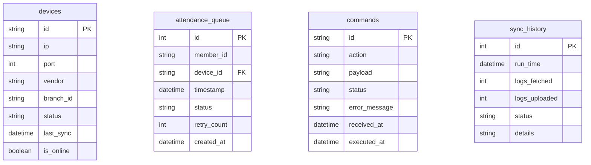
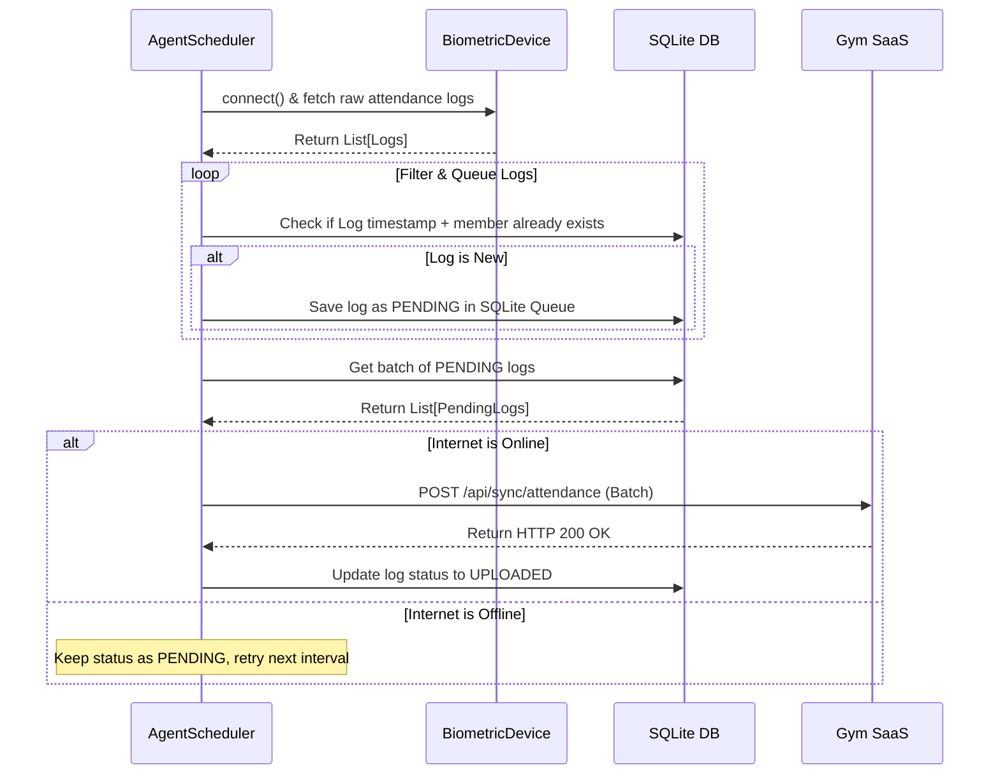

# GymSyncAgent 🚀

GymSyncAgent is a Windows Desktop Biometric Sync Agent designed for Gym Management SaaS. It runs as a background process or Windows Service, pulling attendance logs from LAN-connected biometric devices (ZKTeco, eSSL) and syncing them to the cloud with full offline-queue support.

---

## 🏗️ Clean Architecture Overview

This project is built using **Clean Architecture** and SOLID design principles. It separates the core business rules from external frameworks, devices, and UI modules.

```
GymSyncAgent/
├── app/
│   ├── core/            # Configuration manager & DPAPI security routines
│   ├── database/        # SQLite setup & engine mapping
│   ├── models/          # Declarative SQLAlchemy models
│   ├── repositories/    # Generic repository classes (Base, Device, Log, Command)
│   ├── services/
│   │   ├── device/      # Biometric adapters (ZK, eSSL, Mock) & LAN scanner
│   │   ├── cloud/       # Secure HTTP REST cloud client
│   │   └── sync_service.py # Synchronization orchestrator
│   ├── scheduler/       # APScheduler background cron loops
│   ├── ui/              # PySide6 Desktop GUI dashboard
│   ├── utils/           # Multi-file rotated logging setup
│   └── server.py        # Local diagnostic FastAPI server
├── tests/               # Standalone unit & integration test suites
├── requirements.txt     # Python libraries
├── main.py              # Application runner
└── windows_service.py   # Windows Service registry wrapper
```

---

## 📊 Database Schema (ERD)



---

## 🔄 Sync Control Flow



---

## ⚙️ Installation & Setup

### 1. Prerequisites
- **Python 3.12** installed on Windows.
- SQLite is pre-installed as part of the Python standard library.

### 2. Configure Virtual Environment
Open PowerShell inside `GymSyncAgent` directory:
```powershell
# Create virtual environment
python -m venv venv

# Activate virtual environment
.\venv\Scripts\Activate.ps1

# Install requirements
pip install -r requirements.txt
```

### 3. Run in GUI Mode
```powershell
python main.py
```

### 4. Run in Service (Daemon) Mode
```powershell
python main.py --service
```

---

## 🛠️ Packaging GymSyncAgent.exe
To compile the Python agent into a single executable wrapper for Windows distribution:
```powershell
# Install PyInstaller if not done
pip install pyinstaller

# Package the application using windows entry configurations
pyinstaller --noconsole --onefile --name="GymSyncAgent" main.py
```
*(This produces a standalone executable `dist/GymSyncAgent.exe` which contains all UI and server components).*

---

## 🖥️ Register as a Windows Service
To allow the agent to run automatically at Windows startup without any logged-in user:
```powershell
# Install service
python windows_service.py install

# Configure to start automatically
python windows_service.py --startup auto update

# Start service
python windows_service.py start

# Stop service
python windows_service.py stop

# Remove/Uninstall service
python windows_service.py remove
```

---

## 📶 Local API Endpoints (FastAPI)
The agent hosts a local diagnostic server running on port `8080` (unless configured otherwise in `config.json`):

| Endpoint | Method | Description |
|---|---|---|
| `/status` | `GET` | Returns general telemetry, queue size, and CPU stats. |
| `/devices` | `GET` | Lists all paired hardware biometric terminals. |
| `/sync` | `POST` | Forces an immediate check-in pull and upload run. |
| `/logs/{log_type}` | `GET` | Returns tail records of `attendance`, `device`, `cloud`, or `error` logs. |

---

## 🩺 Troubleshooting Guide

### 1. Connection Errors to Biometric Terminals
- Ensure the biometric device IP matches the IP shown in the **Devices** tab.
- Ping the device IP from the command line: `ping <device_ip>`.
- Verify port `4370` is not blocked by Windows Defender Firewall or local routers.

### 2. Queue Not Uploading to SaaS
- Verify Internet Status shows **ONLINE** on the dashboard tab.
- Check `logs/cloud.log` to see if there are HTTP timeouts or if the JWT Token expired.
- Check `logs/error.log` for database transaction locks.
