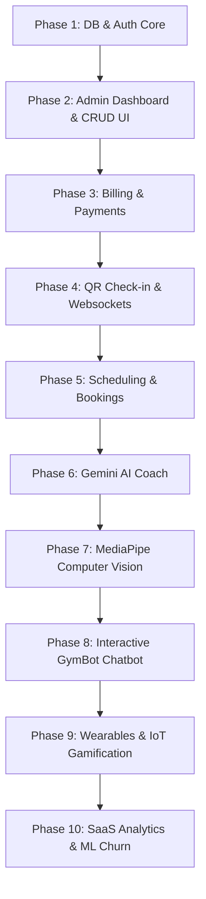

# Gym Management System (GMS) - 10-Phase Innovative Implementation Plan

This plan details a 10-phase implementation roadmap for the Gym Management System (GMS), expanding upon the existing codebase structures. Each phase is broken down into exactly 8 actionable prompts/steps designed for an AI developer to execute with maximum precision and continuation.

---

## Technical Stack & Configuration
*   **Database:** Supabase (PostgreSQL hosting) with Prisma ORM.
*   **Backend:** Node.js + Express (TypeScript).
*   **Frontend:** React (TypeScript) + Vite + TailwindCSS.
*   **Payment Gateway:** Stripe Sandbox & Razorpay integrations.
*   **AI Integrations:** Google Gemini API (Personalized Diet/Workouts), TensorFlow.js & MediaPipe Pose (Webcam Exercise Form Feedback), and custom Hybrid MLP Neural Network + Gemini chatbot.

---

## 10-Phase Roadmap & AI Prompts

---

### Phase 1: Multi-Tenant Schema Validation, Migration, and RBAC Authentication Core
This phase focuses on validating the base database tables, compiling the Prisma client, and establishing the foundational Role-Based Access Control (RBAC) middleware for Multi-Branch architecture.

1. **Prompt 1 (DB Schema Verification):** Write a script to validate the connection to Supabase and execute `npx prisma db push` or migrations based on the schema in [schema.prisma](file:///c:/G.E.N.I.U.S/Internship%20PREP/Websites/Management%20projects/GYM/backend/prisma/schema.prisma). Ensure all models such as `User`, `Member`, and `Branch` compile and the client is generated successfully.
2. **Prompt 2 (Environment Setup):** Configure the environment variables in `backend/.env` including `DATABASE_URL`, `JWT_SECRET`, `ALLOWED_ORIGINS`, and verify loading values securely within `backend/src/config/prisma.ts`.
3. **Prompt 3 (JWT & Password Utilities):** Implement JWT verification, token signing, and bcrypt-based password hashing helper functions inside `backend/src/utils/auth.ts`.
4. **Prompt 4 (RBAC Middleware):** Create the role-based authorization middleware in `backend/src/middleware/auth.ts` to inspect requests for valid JWT headers and check user roles against `UserRole` enum values (`ADMIN`, `STAFF`, `MEMBER`, `TRAINER`).
5. **Prompt 5 (Multi-Branch Tenant Check):** Implement a middleware that extracts `X-Branch-Id` from request headers to automatically scope database queries to the target gym branch, ensuring strict multi-tenant separation.
6. **Prompt 6 (Auth Routes & Password Recovery):** Develop controllers in [auth.routes.ts](file:///c:/G.E.N.I.U.S/Internship%20PREP/Websites/Management%20projects/GYM/backend/src/routes/auth.routes.ts) handling `/register-owner`, `/login`, and `/forgot-password` utilizing `ForgotPasswordToken`.
7. **Prompt 7 (Database Seeding Engine):** Extend the database seed files `backend/src/seed.ts` and `backend/src/seed-billing.ts` to mock dummy data for branches, membership plans, trainers, and sample member accounts.
8. **Prompt 8 (Vitest Suite Initialization):** Establish standard integration tests under `backend/src/tests/auth.test.ts` using Vitest to assert correct login payloads, JWT generation, and middleware response statuses.

---

### Phase 2: Administrative Multi-Branch Dashboard & Member Management UI
Builds the core interface for receptionists and administrators to handle records, manage leads, switch branches, and track member registration details.

1. **Prompt 1 (Auth State Context):** Implement `AuthContext.tsx` and `ProtectedRoute.tsx` on the frontend to manage JWT states, token refreshing, user session metadata, and route protection.
2. **Prompt 2 (Premium Dashboard Shell):** Design a sidebar-oriented admin interface in `frontend/src/components/DashboardLayout.tsx` utilizing a premium dark theme (`bg-gym-darker`), sidebar navigation tabs, and a quick-stats header banner.
3. **Prompt 3 (Branch Switcher Selector):** Add a dropdown branch selector element in the admin layout that updates the active `branchId` in React state and automatically sets the `X-Branch-Id` header for all Axios/Fetch calls.
4. **Prompt 4 (Member Registry Datagrid):** Create `frontend/src/pages/MembersList.tsx` showing a table of members with server-side paginated queries, status search filters (`ACTIVE`, `INACTIVE`, `PAUSED`), and action buttons.
5. **Prompt 5 (Member Onboarding Form):** Develop `frontend/src/pages/MemberRegister.tsx` to handle new member onboarding including contact data, select plan, link trainer, and profile picture upload state.
6. **Prompt 6 (Lead Pipeline Kanban):** Implement the lead management page `frontend/src/pages/Leads.tsx` to track inquiries from prospective customers with columns representing status steps (`NEW`, `FOLLOWED_UP`, `CONVERTED`, `LOST`).
7. **Prompt 7 (Cloudinary Photo Uploader):** Write a file uploader middleware in backend (`backend/src/utils/cloudinary.ts`) using Multer and Cloudinary storage for member profile photos and branch images.
8. **Prompt 8 (Responsive Refactoring):** Apply responsive grid constraints and mobile hamburger menus across all dashboard panels to ensure functional operation on tablet and phone devices.

---

### Phase 3: Automated Gym Billing, Subscription Cycles, and Payment Integrations
Manages member subscription lifecycle, prints dynamic invoice files, and manages payment gateways (Stripe Sandbox + Razorpay).

1. **Prompt 1 (Invoice Calculation Engine):** Create a service in `backend/src/utils/billing.ts` that calculates dues, discounts, GST/tax rates, and generates transactional invoices tied to memberships.
2. **Prompt 2 (Stripe Elements Integration):** Integrate Stripe Sandbox on both client elements (`@stripe/react-stripe-js`) and backend controllers (`stripe.paymentIntents.create`) inside [payment.routes.ts](file:///c:/G.E.N.I.U.S/Internship%20PREP/Websites/Management%20projects/GYM/backend/src/routes/payment.routes.ts).
3. **Prompt 3 (Razorpay Order Orchestration):** Set up backend endpoints to create orders via the Razorpay SDK and verify payment signatures (`razorpayPaymentId`, `razorpaySignature`) from frontend checkouts.
4. **Prompt 4 (Member Billing Panel):** Implement `frontend/src/pages/BillingList.tsx` to display all generated invoices, payment status indicators (`PAID`, `PENDING`, `FAILED`), and PDF download triggers.
5. **Prompt 5 (PDFKit Invoice Generator):** Develop a backend PDF generator using PDFKit to render clean invoices with the gym logo, member details, transaction itemization, and tax calculations.
6. **Prompt 6 (Membership Expiration Scheduler):** Create cron tasks using `node-cron` in `backend/src/config/cron.ts` that run daily to check for memberships reaching their `expiryDate` and mark matching subscriptions as `EXPIRED`.
7. **Prompt 7 (Promocode Controller):** Implement a router for checking and applying active promo codes during subscription checkouts inside `backend/src/routes/saas.routes.ts`.
8. **Prompt 8 (Manual Cash Overrides):** Create front-desk checkout options allowing staff to record physical cash, card swipe, or UPI transactions, creating an immediate `PAID` invoice record.

---

### Phase 4: QR Code Check-In Station, Real-Time WebSockets & Biometric Sync
Builds check-in flows for members scanning digital membership cards, showing instant verification screens for front desk monitors.

1. **Prompt 1 (Digital Membership QR Code):** Implement a dynamic QR code generator component on the member portal using canvas/svg output based on the member's unique database ID.
2. **Prompt 2 (Kiosk Scan Console):** Build `frontend/src/pages/KioskScanner.tsx` using `html5-qrcode` to start the device webcam, scan member QR codes, and trigger verification requests to the server.
3. **Prompt 3 (WebSocket Server Integration):** Set up a Socket.io server instance in `backend/src/index.ts` to handle real-time connection events and broadcast live scan notifications.
4. **Prompt 4 (Real-time Reception HUD):** Build a live dashboard monitor widget on the receptionist’s dashboard that plays status sounds (Success chime, warning buzzer) and displays checked-in member info in real time.
5. **Prompt 5 (Hourly Peak Metrics):** Write an analytics query aggregating check-in times to create a peak hour occupancy chart using Recharts on the dashboard home.
6. **Prompt 6 (Attendance Ledger Sheet):** Build a calendars check-in grid displaying attendance records, total workouts this month, and average time spent at the facility.
7. **Prompt 7 (Local Biometric Sync Mock):** Implement dynamic routes in `backend/src/routes/sync.routes.ts` mocking biometric hardware sync commands (e.g., matching thumbprint hashes to member IDs).
8. **Prompt 8 (Checkout Tracker Logic):** Allow check-in scans to double as checkouts when a member leaves, computing total session duration and saving it to the `CheckIn` database model.

---

### Phase 5: Class Scheduling, Personal Training, and Multi-Branch Booking Engines
Supports class scheduling (Yoga, CrossFit, etc.), assigning personal trainers, and coordinating bookings.

1. **Prompt 1 (Trainer Registry Dashboard):** Implement trainer profiles CRUD in `frontend/src/pages/TrainerPortal.tsx` to log certifications, specialties, and active member counts.
2. **Prompt 2 (Interactive Booking Grid):** Design `frontend/src/pages/Schedules.tsx` featuring a visual calendar view displaying group classes organized by time, trainer, and remaining seats.
3. **Prompt 3 (Booking API Validations):** Write backend validators for class bookings that check for class capacity limits and prevent duplicate bookings for the same member.
4. **Prompt 4 (Trainer Matcher Selector):** Build an administrative panel enabling front desk operators to assign personal trainers to specific members, updating `trainerId` in the `Member` schema.
5. **Prompt 5 (Booking Alerts & WebSockets):** Connect socket listeners to broadcast real-time booking changes so class capacity badges update immediately without manual refreshes.
6. **Prompt 6 (Email Confirmation Delivery):** Write a Nodemailer SMTP transporter script to send class booking confirmations and reschedule notifications to members.
7. **Prompt 7 (PT Rating Registry):** Implement a feedback page allowing members to rate their personal trainers and leave comments, linking entries to the `TrainerFeedback` schema model.
8. **Prompt 8 (Trainer Payroll System):** Create administrative tools to calculate trainer payroll based on session counts, base salaries, and performance bonuses using `backend/src/routes/payroll.routes.ts`.

---

### Phase 6: AI-Powered Workout & Diet Plan Generation (Gemini API Integration)
An innovative addition using the Gemini model to automatically generate personalized fitness and nutrition plans based on member profiles.

1. **Prompt 1 (AI Generation Forms):** Build forms in `frontend/src/pages/MemberPortal.tsx` for members to input target goals, workout frequency, food allergies, and health considerations.
2. **Prompt 2 (Gemini Node.js Client Setup):** Initialize the Google GenAI SDK (Gemini API) configuration on the backend using the system API keys.
3. **Prompt 3 (Structured Prompt Engineering):** Write a backend utility constructing detailed system prompts that inject user parameters and enforce JSON-formatted responses.
4. **Prompt 4 (AI Output Validation):** Implement schema validation using Zod to parse and verify the structure of AI workout/diet suggestions before saving them.
5. **Prompt 5 (AI Plan Creation API):** Build Express routes `/api/members/:id/ai-workout` and `/api/members/:id/ai-diet` handling plan requests and writing results to the DB.
6. **Prompt 6 (Interactive Workout Log UI):** Design React components for members to review their daily workouts, mark exercises as complete, and log weights lifted.
7. **Prompt 7 (Diet Breakdown Charts):** Build caloric and macro breakdown graphs using Recharts, highlighting target percentages of proteins, carbs, and fats.
8. **Prompt 8 (Plan Refinement Assistant):** Add an AI request button allowing members to prompt changes (e.g. "replace eggs with a vegan alternative") and update the database plan.

---

### Phase 7: Real-Time AI Computer Vision Pose Estimation (Webcam Exercise Form Feedback)
An advanced feature utilizing TensorFlow.js and MediaPipe Pose in the browser to track exercise form and count repetitions.

1. **Prompt 1 (Pose Estimation Core Setup):** Integrate TensorFlow.js and `@mediapipe/pose` packages into the Vite frontend project build configurations.
2. **Prompt 2 (Webcam Feed Overlay):** Build a canvas overlay wrapper component displaying the user webcam feed with real-time skeletal node visualizations.
3. **Prompt 3 (Joint Angle Calculators):** Write geometric helper functions calculating target angles (e.g., knee flexion for squats, elbow angles for bicep curls) based on joint coordinates.
4. **Prompt 4 (Rep Counter State Machine):** Create a state machine tracking user movements through eccentric and concentric phases to count repetitions.
5. **Prompt 5 (Visual & Audio Coaching Alerts):** Add UI alerts (e.g. "Go Lower", "Straighten Back") and voice instructions using the Web Speech API during workouts.
6. **Prompt 6 (Session Metric Loggers):** Create a post-workout summary interface showing total reps completed, sets, and average form accuracy.
7. **Prompt 7 (CV Ingestion API):** Write an endpoint `/api/members/cv-workout-log` recording verified repetitions, session duration, and accuracy metrics.
8. **Prompt 8 (Performance-Driven Scaling):** Implement automatic resolution scaling for pose detection processes on devices with lower processing power.

---

### Phase 8: Conversational AI Gym Assistant (Interactive GymBot NLP & Gemini Hybrid)
Provides an interactive chatbot trained on gym services, bookings, and pricing, with an automated fallback to the Gemini model for general questions.

1. **Prompt 1 (GymBot NLP Engine Tuning):** Refine the local neural network training logic in [GymBotEngine.ts](file:///c:/G.E.N.I.U.S/Internship%20PREP/Websites/Management%20projects/GYM/backend/src/utils/GymBotEngine.ts) to train on expanded customer service templates.
2. **Prompt 2 (DB Context Indexing):** Implement an indexing system that formats gym schedules, classes, and pricing options into search blocks for the NLP engine.
3. **Prompt 3 (Intent-to-Action Router):** Design route logic that executes database actions (e.g. scheduling a session) when specific intents are parsed from member messages.
4. **Prompt 5 (Voice Speech Input):** Integrate the browser Web Speech API to support voice-to-text input in the chat box.
5. **Prompt 6 (Floating Chat Interface):** Build a slide-out chat widget on the landing page and member dashboards with typing indicators and suggestions.
6. **Prompt 7 (Session Context Store):** Implement persistent session caching using redis or node-cache to save user chat histories and contexts.
7. **Prompt 8 (Role-based Bot Guards):** Apply validation layers restricting bot responses (e.g. billing history details) based on user authentication status.

---

### Phase 9: Wearable Sync, IoT Equipment Emulator & Gamified Leaderboards
Integrates wellness metrics from user wearables and provides simulated gym equipment data along with member leaderboards.

1. **Prompt 1 (OAuth Wearable Setup):** Implement Google Fit / Apple Health Web API OAuth connection screens and authentication handlers.
2. **Prompt 2 (Wearable Sync Workers):** Set up cron jobs pulling steps, calories burned, and sleep duration metrics from sync connections.
3. **Prompt 3 (Treadmill Emulator Client):** Build a simulated IoT dashboard that mimics running machine outputs (speed, distance, heart rate) and transmits updates via WebSockets.
4. **Prompt 4 (Gamified Member Standings):** Create `frontend/src/pages/Leaderboards.tsx` listing members ranked by monthly step count, check-in frequency, and workout points.
5. **Prompt 5 (Achievements Database Schema):** Extend the database schema to store earned badges (e.g., "7-Day Streak", "Century Club") and member unlocks.
6. **Prompt 6 (Social Workout Wall):** Design a social interface where members can share workouts, comment on achievements, and motivate peers.
7. **Prompt 7 (Activity Trend Charts):** Build dashboard charts displaying member activity metrics overlaid with wearable health readings.
8. **Prompt 8 (Recovery Score Computations):** Implement algorithm checks that estimate user recovery scores and recommend target workout difficulties.

---

### Phase 10: Multi-Tenant SaaS Management, Predictive Churn AI & Owner Billing Admin
Deploys the application as a scalable SaaS product with subscription gates, owner registration flows, and predictive analytics tools.

1. **Prompt 1 (SaaS Portal Landing Page):** Design an interface displaying tier options (Starter, Professional, Enterprise) and containing interactive cost calculators.
2. **Prompt 2 (Owner Registration Flow):** Build onboarding forms (`RegisterOwner.tsx`) allowing gym owners to register, select plans, and create their first branch.
3. **Prompt 3 (Automatic Tenant Gates):** Create middleware checks verifying `SaaSSubscription` records and blocking update requests from expired tenants.
4. **Prompt 4 (Predictive Churn Engine):** Write database analytics tracking member check-in trends and flagging accounts with declining activity scores.
5. **Prompt 5 (SaaS Global HUD):** Design a super-admin dashboard highlighting recurring revenue (MRR), total active gym tenants, and system performance logs.
6. **Prompt 6 (Marketing Automation Hub):** Create automated email triggers sending promotions and invitations to members flagged as churn risks.
7. **Prompt 7 (Branch Financial Reports):** Build accounting layouts displaying revenue balances, supplement sales, and payroll expenses.
8. **Prompt 8 (Production Deployment Prep):** Write production build configurations, environment checklists, and deploy the application.

---

## Verification Plan

### Automated Test Pipelines
*   **Prisma Validation:** Run `npx prisma validate` to confirm schema integrity.
*   **Backend Test Execution:** Execute `npm run test` within `backend/` to verify auth controllers.
*   **Production Compilations:** Run `npm run build` in both `frontend/` and `backend/` directories to confirm type-safety compliance.

### Manual Verification
*   **Cross-Tenant Scoping:** Log in as two separate gym owners, verify that neither can access the other's member records or branches.
*   **Kiosk Scanner Mode:** Launch kiosk scanner mode with a webcam, scan a mock member QR code, and verify sound triggers and WebSocket updates.
*   **AI Form Feedback Verification:** Perform mock movements in front of the MediaPipe tracker, checking visual overlay reactions and rep counting accuracy.
