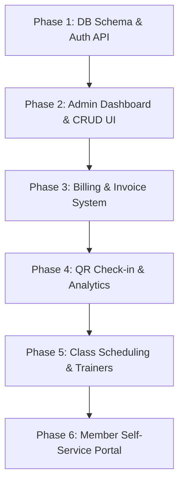

# Gym Management System (GMS) - Phase-Wise Implementation Plan

This plan details a structured, 6-phase approach to building a Gym Management System. The goal is to build a solid foundation first and layer features incrementally to avoid integration issues.

---

## Technical Stack & Configuration
*   **Database:** Supabase (PostgreSQL hosting) with Prisma ORM running in the Express backend.
*   **Backend:** Node.js + Express (TypeScript).
*   **Frontend:** React (TypeScript) + Vite + TailwindCSS.
*   **Payment Gateway:** Stripe Integration (using Stripe elements / checkout on frontend, and webhook handler on Express backend).

---

## Phase-Wise Roadmap

### Phase 1: Database & Core Authentication (Foundation)
*   **Database Design:** Set up PostgreSQL tables using Prisma ORM:
    *   `User` (id, email, password_hash, role: ADMIN/STAFF/MEMBER, profile details)
    *   `Member` (id, user_id, join_date, status: ACTIVE/INACTIVE/PAUSED, emergency_contact)
    *   `MembershipPlan` (id, name, price, duration_months, description)
    *   `Subscription` (id, member_id, plan_id, start_date, end_date, status)
    *   `Payment` (id, subscription_id, amount, status: PAID/PENDING, payment_date, method: CASH/CARD/UPI)
    *   `CheckIn` (id, member_id, timestamp)
*   **Authentication & Security:**
    *   Implement JWT-based sign-in and password hashing (bcrypt).
    *   Setup role-based access control (RBAC) middleware in Express.
*   **Core APIs:**
    *   Create endpoints for membership plan CRUD.
    *   Create endpoints for member registration (which auto-creates a User record).

### Phase 2: Staff/Admin Dashboard & Member CRUD (Core UI)
*   **Dashboard Layout:** Responsive layout with sidebar navigation, stats header, and user profile control.
*   **Member Management UI:**
    *   Listing view: Search, filter by membership status (Active, Expired, Suspended).
    *   Registration form: Input contact info, select plan, and upload profile photo.
    *   Profile detail view: Display subscription history, attendance log, and billing records.
*   **Plan Settings UI:** Add, edit, or deactivate membership packages.

### Phase 3: Billing, Payments, and Invoicing
*   **Billing Engine:**
    *   Auto-generate an invoice when a member subscribes to a plan.
    *   Identify members with expired subscriptions and update their status to `INACTIVE`.
*   **Payment Tracking UI:**
    *   Record manual payments (Cash, Card swipe, or UPI) at the front desk.
    *   Integration of test payment gateway (Stripe Sandbox) for processing card transactions.
*   **Invoice Generator:** Create clean, print-friendly invoice PDFs with the gym logo, member details, transaction itemization, and tax calculations.

### Phase 4: QR Attendance & Live Check-in Monitor
*   **Check-in Station:**
    *   Create a simple "Kiosk Mode" page where receptionists can scan barcodes/QR codes, or enter numerical member IDs.
    *   Real-time validation: Immediately display member's name, profile photo, and check-in status (Green for Active, Red for Expired/Unpaid).
*   **Live Dashboard Metrics:**
    *   Total members checked in today.
    *   Active/inactive membership ratios.
    *   Monthly revenue and outstanding balances.
    *   Peak hour visualization chart (occupancy vs. hour of day).

### Phase 5: Trainer Rosters, Classes, and Bookings
*   **Trainer Assignment:** Add trainer profiles and link them to members for 1-on-1 personal training.
*   **Group Class Schedules:** Create recurring classes (Yoga, CrossFit, Zumba) with times, capacities, and locations.
*   **Booking Portal (Internal):** Front desk booking of group classes and PT slots on behalf of members.

### Phase 6: Member Self-Service Portal
*   **Member UI:** A simplified web portal where members can:
    *   View their digital membership card (QR Code).
    *   Check their subscription history, active plan duration, and download invoices.
    *   Book group classes and see trainer availability.

---

## Decisions & Setup Info
*   **Database:** Supabase Postgres.
*   **Payment Gateway:** Stripe Sandbox.
*   **Arch/Stack:** React + Node.js/Express + Prisma + TailwindCSS.

---

## Verification Plan

### Automated & Manual Verification
*   **Database:** Run Prisma migration commands and inspect schema tables.
*   **Authentication API:** Test endpoints using Postman/Thunder Client or a quick test script to verify token issuance and role checks.
*   **Frontend UI:** Build components using clean layouts and verify responsiveness across mobile/tablet views.
